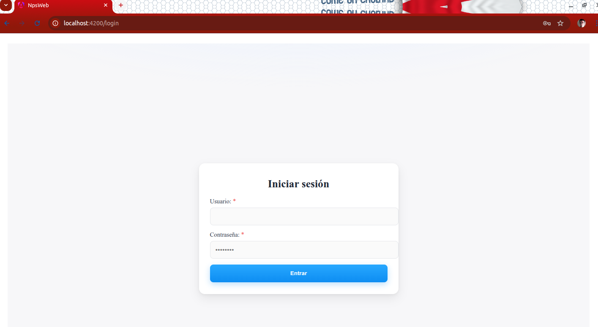
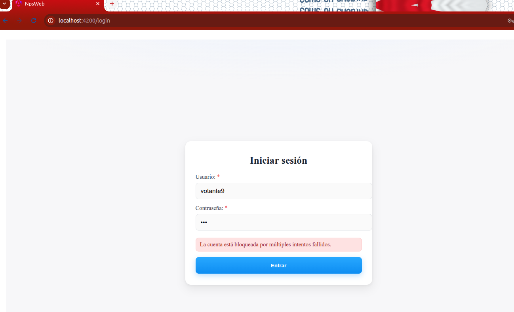
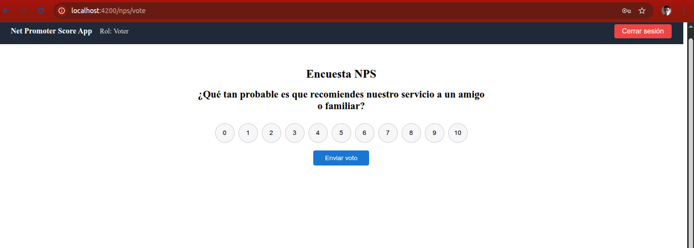
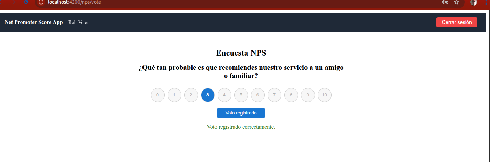
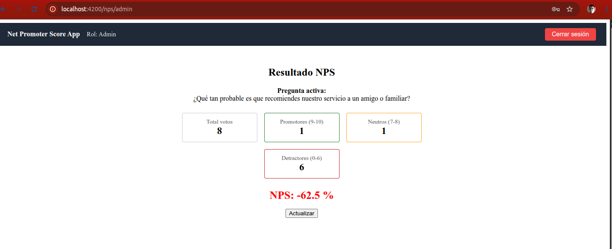
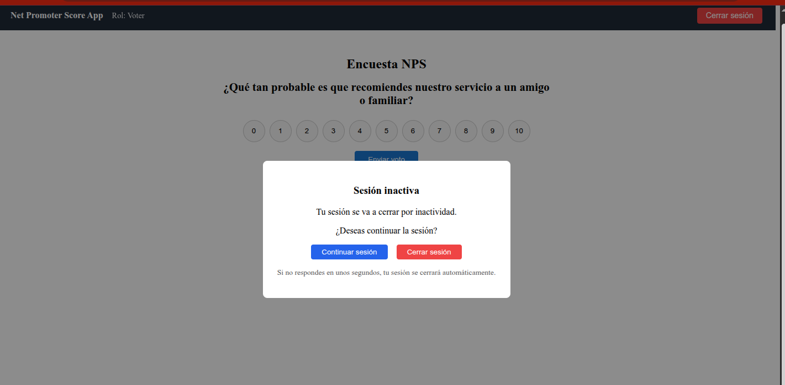

<h1 align="center"> Prueba Técnica - NPS-APP Cibergestion</h1>

## BackEnd NPSApi (.NET 8 + SqlServer + JWT+ Dapper+ Fluent Validation+ Automapper + MediatR)
### API REST: login con **JWT**, refresh token, validacion de intentos fallidos,  registro de **Votos de la pregunta de NPS**, consulta de **Estadisticas del Resultado de NPS **, Validacion de Roles Admin y votante y cierre de sesion despues de 5 minutos. Conecta a **SQLServer**.
---
<details open>
<summary>
## ✅ Pre-requisitos
</summary>
Para ejecutar la aplicacion necesita tener instalado:

- Instacia de SQLServer
- Crear BD + tablas del programa con este script: 
[init.sql](./init.sql)
</details>

<details open>
<summary>
## 🚀 Ejecutar la aplicacion
</summary> <br>
para ejecutar la aplicacion:

1. Clone el repositorio:

```shell
https://github.com/derpito8909/NPS_API.git
```
2. Ingrese a la carpeta /NPS_API/NPS_API/ e ingrese estos comandos para inicar la aplicacion

```shell
 cd NPS_API/NPS_API/
 dotnet restore
 dotnet build
 dotnet run --project src/Nps.Presentation/Nps.Presentation.csproj
```
</details>

<details open>
<summary>
Descripción de los Endpoint
</summary> <br />

## Endpoint: `POST /auth/login`

- **Método:** `POST`
- **Descripción:** autentica y devuelve un accessToken (JWT). credenciales fijas
en memoria

### Parámetros de Solicitud

- `username` (requerido): Usuario por defecto
- `password` (requerido): Contraseña por defecto.

```json
{ "username": "admin", "password": "Admin123!" }
```

### Respuesta

```json
{
  "accessToken": "eyJhbGciOiJI....",
  "accessTokenExpiresAt": "2025-11-18T04:35:58.2083275Z",
  "refreshToken": "Wj92nolkdMWJ1E....",
  "refreshTokenExpiresAt": "2025-11-25T04:30:58.2304432Z",
  "username": "admin",
  "role": "Admin"
}
```
## Endpoint: `POST /auth/refresh`

- **Método:** `POST`
- **Descripción:** hace el proceso de refrescar el token para continuar la sesion activa

### Parámetros de Solicitud

- `refreshToken` (requerido): cadena de caracteres con el refresh token a actualizar

```json
{
  "refreshToken": "string"
}
```

### Respuesta

```json
{
  "accessToken": "eyJhbGciOiJIUzI...",
  "accessTokenExpiresAt": "2025-11-18T04:40:57.2327582Z",
  "refreshToken": "W2O0DGz....",
  "refreshTokenExpiresAt": "2025-11-25T04:35:57.2332559Z",
  "username": "admin",
  "role": "Admin"
}
```
## Endpoint POST /Nps/vote (Protegido) (solo parar rol votante)

- **Método:** `POST`
- **Descripción:** registra el valor del voto del usuario

### Parámetros de Solicitud

- `score` (requerido): valor numero de 0-10 del valor selecionado por el usuario

```json
{
  "score": 0
}
```

### Respuesta

```json
{
  "message": "Voto registrado correctamente.",
  "score": 5,
  "classification": "Detractor"
}
```
## Endpoint GET /Nps/result (Protegido)(solo para rol Admin)

- **Método:** `GET`
- **Descripción:** obtiene el resultados de las estadisticas de los votos de la consulta NPS

### Respuesta

```json
{
  "question": "¿Qué tan probable es que recomiendes nuestro servicio a un amigo o familiar?",
  "totalVotes": 6,
  "promoters": 1,
  "neutrals": 1,
  "detractors": 4,
  "nps": -50
}
```
## Endpoint GET /Nps/active (Protegido)

- **Método:** `GET`
- **Descripción:** Obtiene la pregunta NPS que esta activa y quiera ser utilizada para votar

### Respuesta

```json
{
  "question": "¿Qué tan probable es que recomiendes nuestro servicio a un amigo o familiar?"
}
```
</details>

# FrontEnd CCLInventario (Angular 19, Standalone, TypeScript)
Pagina web para visualizar el APP la consulta NPS
Incluye: **Login JWT**, **Consulta y botones de 0-10 para votar**, **seccion de estadisticas de los resultados de los votos**
---
<details open>
<summary>
## ✅ Pre-requisitos
</summary>
Para ejecutar la aplicacion necesita tener instalado:
  
- **Node.js** 20+ (recomendado LTS)
- **Angular CLI** 19: `npm i -g @angular/cli@19`
- Acceso al **API** corriendo en local
</details>

<details open>
<summary>
## 🚀 Ejecutar la aplicacion
</summary> <br>
para ejecutar la aplicacion:

1. Clone el repositorio:

```shell
https://github.com/derpito8909/NPS_API.git
```
2. Ingrese a la carpeta /NPS_API/nps-web e ingrese estos comandos para inicar la aplicacion

```shell
 cd NPS_API/nps-web
 npm i
 ng serve -o
```
3. se visualiza la pagina de login (el aplicativo por defecto trae un admin y contraseña: Admin123!, un usuario votante1 y contraseña: test123)
   

4. se ingresa con un usuario y contraseña, si se digita incorectamente la contraseña 3 veces el usuario se bloquea
   

5. al ingresar correctamente con un usuario perfil votante se visualiza la pantalla para votar, con la pregunta y unos botones del 0-10 para que el usuario lo selecione y de clic en el boton enviar voto.
   

6. si se registra correctamente el voto sale un mensaje de confirmacion y todo queda bloqueado para que no realice otro voto y si lo intenta se mostrar un mensaje que ya se voto
  
  

7. el usuario con el perfil admin puede ver las estadistas de los resultados de los votos y tener un boto de actualizar para tener actualizados los resultados en cualquier momento
   
   
8. si el usuario no realiza ninguna acion de voto o consulta en 5 minutos la sesion se puedo expirar y cerrar. igual puedo refrescar para continuar la sesion
     
</details>

## Autor

<p>desarrollador por David Esteban Rodriguez Pineda 2025&copy;</p>
